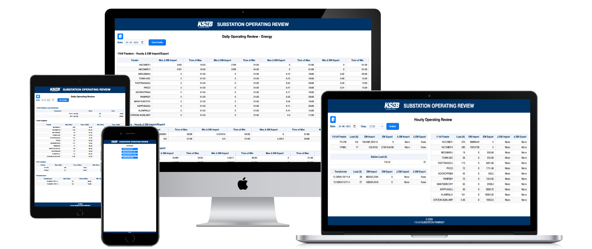

# Substation Operating Review App
Web application to review and analyze SOS data.


## Features
- Hourly Operating Review
- Dialy Operating Review (Load, Energy)
- Town ABC Feeder Details

## Setup
- Update `DATABASE` path in `config.py`
```cmd
python -m venv venv
venv\Scripts\activate # source venv/bin/activate
pip install -r requirements.txt
python app.py
```
