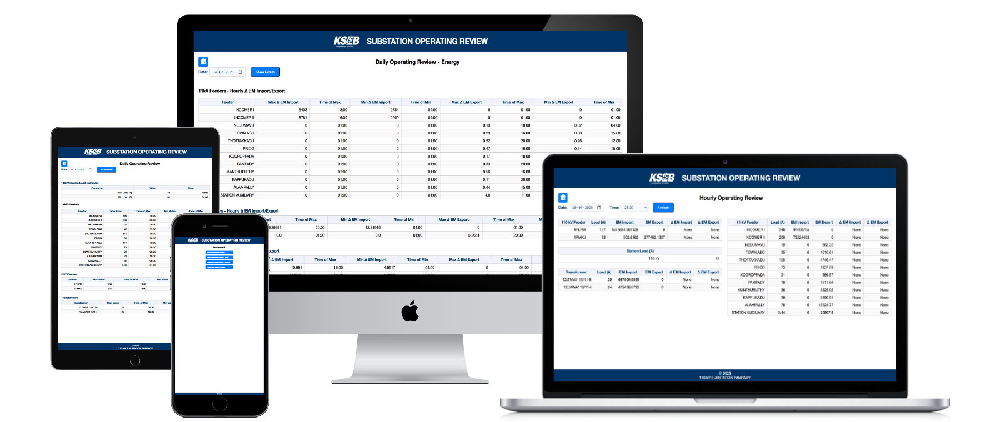

# Substation Operating Review App
Web application to review and analyze SOS data.


## Features
- Hourly Operating Review
- Dialy Operating Review (Summary, Load, Energy)
- Monthly Operating Review
    - Interruptions
    - Energy Transaction
    - Town ABC Feeder Details

## Usage
- Download latest exe file from [Github Releases](./releases)
- Double click to open
- Open any browser (preferably, Chrome) and go to http://localhost:5000/

## Development Setup
Install dependencies
```cmd
python -m venv venv
venv\Scripts\activate # source venv/bin/activate
pip install -r requirements.txt
```
Run application
```cmd
python app.py
```
Package application
```cmd
package.bat
```
